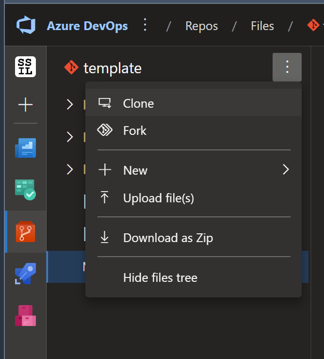

# Introduction 
TODO: template repo, create a pull request then save as your own repo

# Prerequisites
1.	Ensure you have Miniconda: https://repo.anaconda.com/miniconda/Miniconda3-py39_4.11.0-Windows-x86_64.exe
2.  Ensure you have vscode: https://code.visualstudio.com/download

# Set up repo:
1. Next to the the name of the repo, 'template', click the more options then "clone":

	Open Anaconda Prompt from ‘Start’ -> ‘Anaconda3 (64 bit)’ -> ‘Anaconda Prompt’, enter “conda init”.

2. Click 'Clone in VS Code' under 'IDE':

After Anaconda is installed, the next step is to create the Anaconda environment which will install all the necessary package dependencies. To do this, you will need to open a Command Prompt window. You can search for Command Prompt from the windows start menu to open the Command Prompt.
Here is link for the Anaconda environment file on sharepoint: sfile_wrts.yml. We will use this file later so please copy this file to your local location.
From the Command Prompt you type or paste the command seen below after replacing “C:\path\to\sfile_wrts.yml” with the path to the .yml file on your machine:
•	conda env create -f C:\path\to\sfile_wrts.yml

# Contribute
TODO: feel free to contribute to make this better, but please don't overwrite the template!
